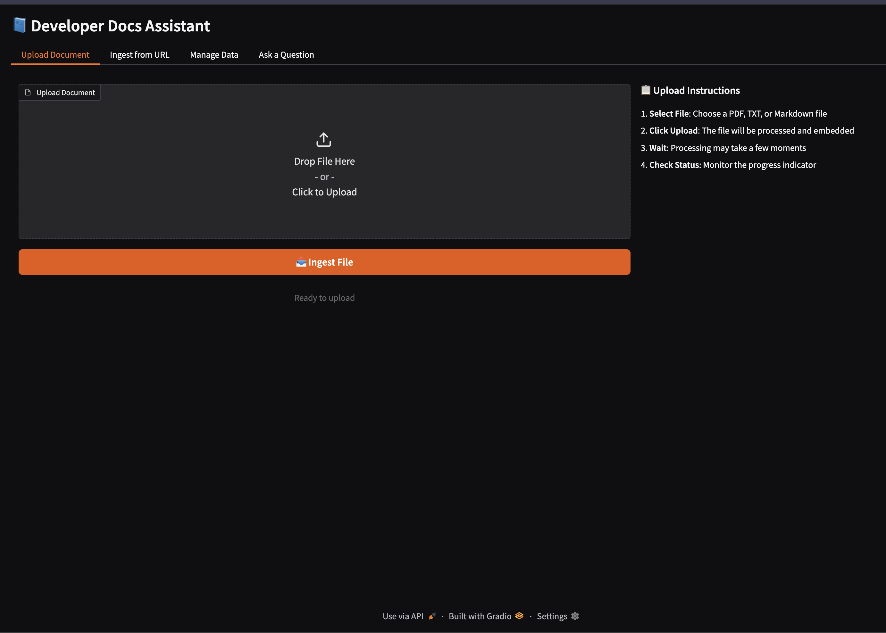
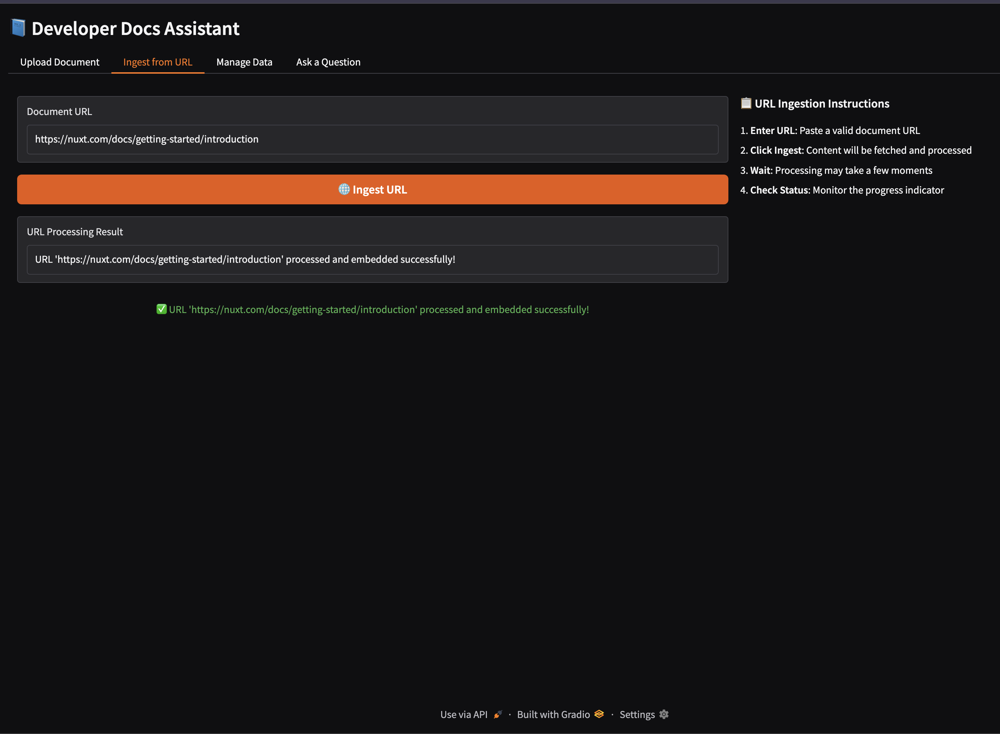
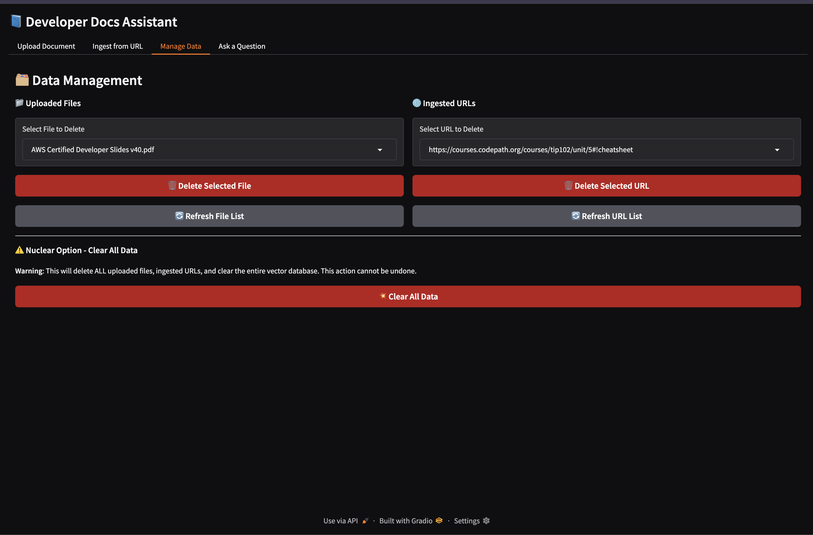
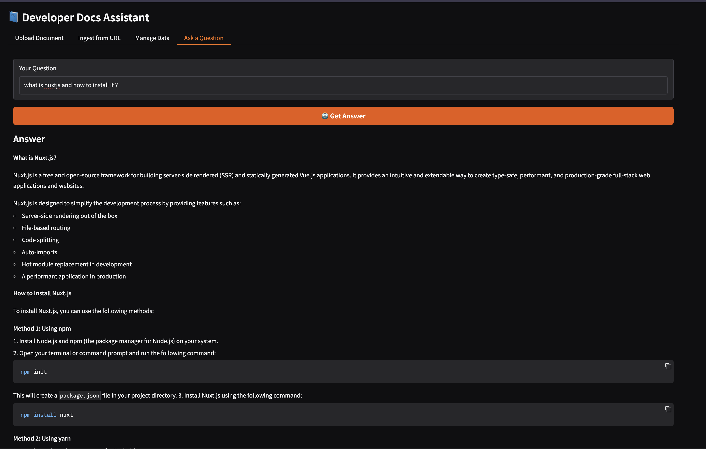

# 📘 Dev Docs Chat

A powerful RAG (Retrieval-Augmented Generation) system that allows you to upload documents, ingest content from URLs, and ask questions about your knowledge base with AI-powered answers.

## 🚀 Features

### 📁 **Document Support**

- **PDF Files**: Extract and process PDF documents
- **Text Files**: Plain text document processing
- **Markdown Files**: Structured markdown with proper parsing
- **URL Ingestion**: Fetch and process content from web URLs

### 🎯 **Core Functionality**

- **Smart Search**: Vector-based semantic search across your documents
- **AI-Powered Q&A**: Get intelligent answers based on your content
- **Conversational Memory**: Maintains context across multiple questions

### 🗂️ **Data Management**

- **File Upload**: Drag-and-drop interface for document ingestion
- **URL Ingestion**: Process web content with progress indicators
- **Delete Operations**: Remove files, URLs, and their embeddings
- **Bulk Clear**: Reset entire knowledge base with one click

## 🛠️ Installation

### Prerequisites

- Python 3.10+
- pip package manager

### Setup Instructions

1. **Clone the repository**

   ```bash
   git clone https://github.com/GovindKurapati/dev_docs_chat.git
   cd dev_docs_chat
   ```

2. **Create virtual environment**

   ```bash
   python -m venv venv
   source venv/bin/activate  # On Windows: venv\Scripts\activate
   ```

3. **Install dependencies**

   ```bash
   pip install -r requirements.txt
   ```

4. **Set up environment variables**
   Create a `.env` file in the project root:

   ```env
   GROQ_API_KEY=your_groq_api_key_here
   GROQ_API_BASE=https://api.groq.com/openai/v1
   ```

5. **Get API Key**
   - Sign up at [Groq](https://console.groq.com/)
   - Generate an API key
   - Add it to your `.env` file

## 🚀 Usage

### Starting the Application

```bash
python app.py
```

The application will be available at `http://127.0.0.1:7860`

## 📸 Screenshots

### Document Upload
Upload and process PDF, TXT, and Markdown files with drag-and-drop interface.



### URL Ingestion
Fetch and process content from web URLs with progress indicators.



### Data Management
Manage your uploaded files and ingested URLs with easy deletion options.



### Q&A Interface
Ask questions about your documents and get AI-powered answers with markdown formatting.



## 📁 Project Structure

```
dev-docs-chat/
├── app.py                 # Main Gradio application
├── qa_pipeline.py        # Question-answering logic
├── ingestion.py          # Document ingestion logic
├── requirements.txt      # Python dependencies
├── .env                 # Environment variables (create this)
├── chroma_db/          # Vector database storage
├── uploads/            # Uploaded file storage
├── ingested_urls.txt   # List of ingested URLs
└── README.md           # This file
```

## 🔧 Technical Details

### **Architecture**

- **Vector Database**: ChromaDB for efficient similarity search
- **Embeddings**: HuggingFace sentence-transformers
- **LLM**: Groq's fast LLM for quick responses
- **Framework**: Gradio for web interface

## 🎯 Use Cases

### **📚 Documentation Assistant**

- Upload project documentation and README files
- Ask questions about implementation details
- Get instant answers about your codebase

### **🔍 Research Tool**

- Ingest research papers and technical articles
- Ask questions about new technologies
- Stay updated with industry trends

### **📖 Learning Platform**

- Upload tutorials and educational content
- Ask questions about complex topics
- Get personalized explanations

## 📈 Future Enhancements

- [ ] **Streaming Responses**: Real-time answer generation
- [ ] **File Type Support**: Excel, Word, PowerPoint documents
- [ ] **Advanced Search**: Filters and date-based search
- [ ] **Export Features**: Save conversations and answers
- [ ] **User Authentication**: Multi-user support
- [ ] **API Endpoints**: REST API for integration

## 🤝 Contributing

1. Fork the repository
2. Create a feature branch
3. Make your changes
4. Add tests if applicable
5. Submit a pull request

## 📄 License

This project is licensed under the MIT License - see the LICENSE file for details.

## 🙏 Acknowledgments

- **LangChain**: For the RAG framework
- **ChromaDB**: For vector storage
- **Gradio**: For the web interface
- **Groq**: For fast LLM inference
- **HuggingFace**: For embedding models

---

**Made with ❤️ by Govind Kurapati**
